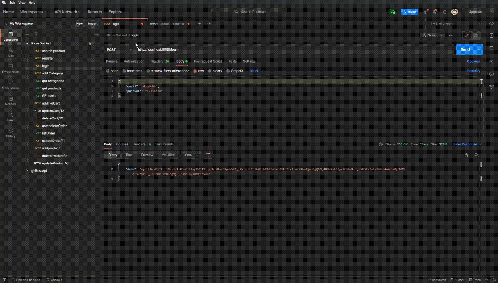
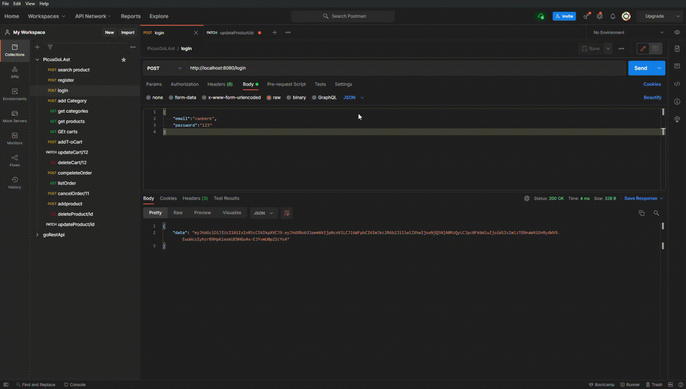
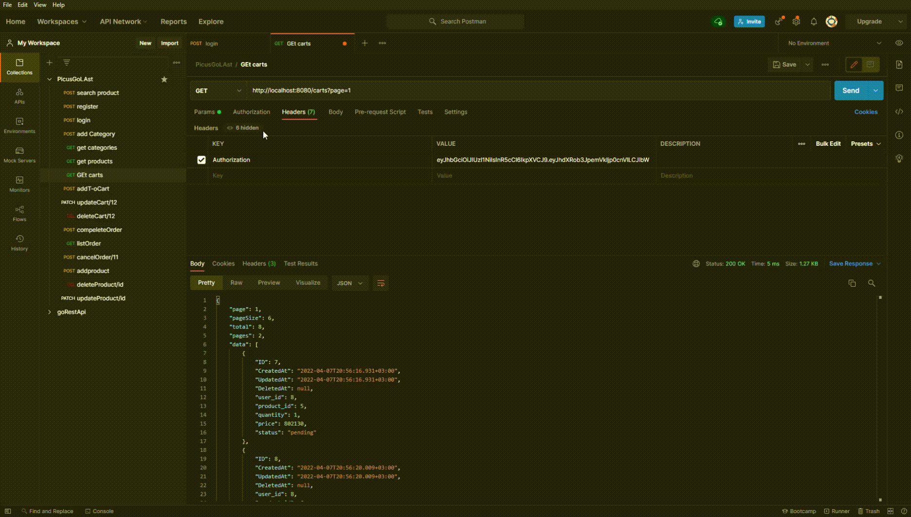

# GoLang E-TİCARET UYGULAMASI


Bu uygulama Patika ve Picus Security iş birliğinde gerçekleşen Golang Backend Web Development Bootcamp kapsamındaki **bitirme projesini** içermektedir.  
Proje içeriği olarak isterlere uygun bir şekilde ***basket servisi*** geliştirilmiştir. 

Kullanıcıların Login ve Register işlemleri yapılmıştır. Login olan kullanıcılar rollerine bağlı olarak ödevde belirtilen işlemleri yapabilmektedir. Örnek olarak login olan kullanıcı Admin değilse Product kategori create edemeyecektir. Herkese açık olan işlemleri hem admin hem normal kullanıcılar yapabilir.G

<br>
<br>

# İçindekiler
- [Uygulama İsterleri](#uygulama-i%CC%87sterleri)  
- [Uygulama Öncesi Hazırlık](#uygulama-%C3%B6ncesi-haz%C4%B1rl%C4%B1k)  
- [Uygulama İçeriği](#uygulama-i̇çeriği)  
- [Postman Collection](#postman-collection)  


<br>  
<br>  

# Uygulama İsterleri

    1. Sign-up
    • Kullanicidan gerekli bilgileri alip veri tabaninda bir kullanici olusturmalisiniz ve cevap olarak JWT token donmelisiniz.
   
    2. Login
    • Veri tabaninda kayitli kullanicilar email ve sifre ile sisteme giris yapmali eger iki bilgi de dogruyse JWT token olusturup kullaniciya donmelisiniz.
    
    3. Create Bulk Category
    • Bu endpoint ile sadece admin rolundeki kullanicilar CSV dosyasi yukleyerek yeni bir kategori yaratmali
    
    4. List Category 
    • Veri tabaninda aktif ve silinmemis olan tum kategoriler listelenmeli
   
    5. AddToCart
    • Sisteme giris yapmis ve Token  suresi gecmemis kullanicilar urunlerini sepete ekleyebilir
    
    6. List Cart Items
    • Kullanicilar sepetine ekledigi urunleri listeleyebilir
   
    7. Update/Delete Cart Items
    • Kullanicilar sepetine ekledigi urunlerin adetini guncelleyebilir ya da urunu sepetten cikarabilir
   
    8. Complete Order
    • Kullanicilar sepetine ekledigi urunler ile bir siparis olusturabilir
   
    9. List Orders
    • Musteriler kendisine ait gecmis siparisleri goruntuleyebilir
   
    10. Cancel Order
      - 	Eger musterinin siparis tarihini henuz 14 gunu gecmediyse musteri siparisini iptal edebilir. Siparis olusma tarihinden sonra 14 gun gectiyse iptal istegi gecersiz olmalidir.

    11. Create Product 
    • Admin rolündeki kullanıcılar sisteme tekil olarak ürün oluşturabilmeli.
    
    12. List Product
    • Kullanıcılar tüm ürünleri listeleyebilmeli. Burada rol kontrolü yok.
   
    13. Search Product
    • Kullanıcılar ürünler içerisinde arama yapabilmeli. Arama kısmında ürün adı, sku vb. gibi alanlarda arama yapılabilir.

    14. Delete Product
    • Admin rolündeki kullanıcılar ürün silebilir.
   
    15. Update Product
    • Admin rolündeki kullanıcılar ürünü güncelleyebilir.


<br>  
<br>  


# Uygulama Öncesi Hazırlık

- **Uygulama içinde kullanılan yapılar:** if/else,struct,interface,slice,for,

<br>

- **Proje içeriğinde kullanılan paketler:** `gin`,`gorm`,`mysql`,`strings`,`http`,`path`,`jwt`,`strconv`,`encoding/csv`,`os`


<br>
<br>
<br>

# Uygulama İçeriği

- Projede kullanıcıların ürün, sepet, sipariş istekleri için **CRUD işlemleri** uygulanmıştır.

- Öncellikle veritabanı bağlantısı için `config/migration` içinde bir bağlantı tanımlanmıştır sonrasında `main` içinde gerekli bilgiler giririp dbye bağlantı sağlanmıştır.

<br>

- `controller` altında kullanıcıların yapabileceği işlemler ile ilgili fonsiyonlar bulunmaktadır. Örnek olarak aşağıda kullanıcının bütün kategorileri sayfa sayfa listeleme işlemi için bir fonskiyon yazılmıştır.

```
func GetCategories(g *gin.Context) {

	pageIndex, pageSize := GetPaginationParameterFromRequest(g)

	items, count, _ := helper.GetCategory(pageIndex, pageSize)

	paginationResult := NewFromRequest(g, items, count)

	paginationResult.Data = items

	g.JSON(http.StatusOK, paginationResult)

}
```

<br>

- `middlewares` dosyası altında token kontrolleri yapılmaktadır. Burada kullanıcının admin mi yoksa normal bir kullanıcı mı olduğuna bakılmaktadır. Bu denetimler `main` fonksiyonu altında routerlara tanımlanıp kontrol sağlaması gerçekleştirilmiştir.

```
//* User Middleware
	router.Use(middlewares.AuthLogin())

//* Admin Middleware
	router.Use(middlewares.AuthJWTAdmin())  

```

<br>

- `models` dosyası altında kullanılan structlar ve onlara bağlı `CreateCart` vb. gibi methodlar bulunmaktadır.

```
type Cart struct {
	gorm.Model
	UserID    uint   `gorm:"primary_key;auto_increment" json:"user_id"`
	ProductID uint   `json:"product_id"`
	Quantity  uint   `json:"quantity"`
	Price     uint   `json:"price"`
	Status    string `json:"status"`
}

func (c *Cart) CreateCart() (*Cart, error) {

	err := configs.DB.Create(c).Error

	if err != nil {
		return nil, err
	}

	return c, nil

}
```

<br>

- `helper` dosyası altında kullan yardımcı fonksiyonlar bulunmaktadır. Bunlar örnek olarak pagination için veya bir slice'ın o item'a sahip olup olmadığının kontrollü gibi.  
<br>

- **UNIT TEST Buraya açıklama yazmalısın**


# Postman Collection 

### Uygulamanın Postman Collection'nına göz atmak için butona tıklayınız.

<br>

[](https://app.getpostman.com/run-collection/198dc50aa390937de661?action=collection%2Fimport)

------
<br>

Login, Cart listeleme, product ekleme örneklerden bazıları aşağıdaki gibidir

<br>

- Burada login olan admin kullanıcısı product güncellemesi yapabilmektedir.



<br>

- Burada loign olan normal bir user product güncellemek istediğinde ise hata alır.



<br>

- Burada bir listeleme yapılmaktadır ve pagination örneği gösterilmektedir.



<br>


